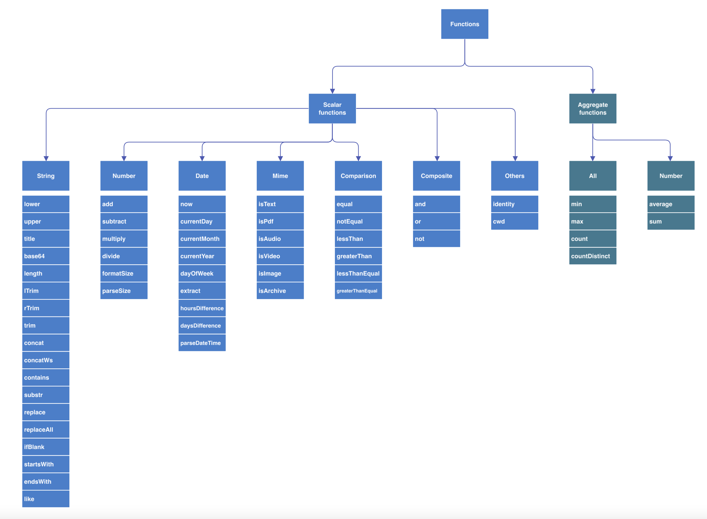

# goselect [](https://github.com/SarthakMakhija/goselect/actions)  [](https://codecov.io/gh/SarthakMakhija/goselect)
`goselect` provides SQL like 'select' interface for file systems.

# Examples 

```SQL
- select * from .
- select * from . limit 10
- select name, size from . where gt(size, 1024)
- select name, size from . where gt(size, 1024) order by 2 desc
- select name, size from . where gt(size, 1024) order by 2 
- select name, size from . where gt(size, 1024) order by 2 limit 10
- select name, size from . where or(like(name, result.*), eq(isdir, true)) order by 2 limit 10
```


# Feature overview 

`goselect` provides various features including:
1. Support for attribute aliases. For example, **filename** is same as **fname**
2. Support for function aliases. For example, **lower** is same as **low**
3. Support for various string scalar functions like `lower`, `upper`, `concat`, `substr` etc
4. Support for various comparison scalar functions `eq`, `le`, `lt`, `ge`, `gt` etc
5. Support for various date based scalar functions `now`, `extract`, `parsedatetime`, `daysdifference` etc
6. Support for various composite scalar functions `or`, `and`, `not` etc
7. Support for various mime type scalar functions `isText`, `isPdf`, `isImage` etc
8. Support for various aggregate functions like `count`, `countdistinct`, `average` etc
9. Support for exporting the results in **table**, **json** and **html** format
10. Support for performing select in nested directories
11. Support for skipping directories like `.git` & `.github`

# Differences between SQL select and goselect's select 

Features that are different from SQL:
1. `goselect` does not support 'group by'. All the aggregating functions return results that repeat for each row
2. `goselect` does not support expressions like 1+2 or 1*2. Instead, `goselect` gives functions like 'add' and 'mul' etc to write such expressions
3. `goselect` does not support expressions like name=sample.log in 'where' clause. Instead, various functions are given to represent such expressions. These functions include: 'eq', 'ne', 'lt' etc
4. `goselect` has a weak grammar. For example, a query like: select 1+2, name from /home/projects will ignore 1+2 and return file names
5. `goselect`'s 'order by' clause supports only attribute positions. For example, a query like: select name, size from /home/projects order by 1 will order the results by first attribute
6. `goselect` does not support single quote ['] and double quotes["]. For example, to match a file name, one could simply write a query: select * from . where eq(name, sample)

# Supported platforms

- `goselect` has been tested on **macOS Big Sur 11.4** and **Ubuntu 20.0.3**

# Installation on macOS

**Download the current release**
- `wget -o - https://github.com/SarthakMakhija/goselect/releases/download/v0.0.3/goselect_0.0.3_Darwin_all.tar.gz`

**Unzip the release in a directory**
- `mkdir goselect && tar xvf goselect_0.0.3_Darwin_all.tar.gz -C goselect`

# Installation on Linux (amd64)

**Download the current release**
- `wget -o - https://github.com/SarthakMakhija/goselect/releases/download/v0.0.3/goselect_0.0.3_Linux_x86_64.tar.gz`

**Unzip the release in a directory**
- `mkdir goselect && tar xvf goselect_0.0.3_Linux_x86_64.tar.gz -C goselect`

# Screenshots
- Limit clause
  

- Where clause
  

- Export as json
  

- Export as json to a file
  


# Changes in Version 0.0.3

1. Adoption of consistent file size units. File size is now reported in IEC units: (B, KiB, MiB, GiB, TiB, PiB, EiB) 
2. No extension is reported for hidden files
3. `*` projection now returns `name`, `extension`, `size` and `absolute path`
4. `fmtsize` is provided as a function that can be used to format the file size
5. `hsize` (or human-readable size) is dropped from attribute list in favor of the function `fmtsize`. Use `fmtsize(size)` to get the formatted size 

# Changes in Version 0.0.2

1. Support for getting the **mime type** from a file
2. Support for various functions like `isPdf`, `isVideo`, `isText`, `isAudio` and `isImage` that work on the **mime type**

## Example Queries for mime type

```SQL
1. select name, size, hsize, mime from ~/Documents/ where eq(isImage(mime), true)  order by 2 desc limit 10
2. select name, size, hsize, mime from ~/Documents/ where eq(isPdf(mime), true)  order by 2 desc limit 10
```

# FAQs

1. **How do I get a list of all the supported attributes?**

Use `goselect listAttributes` or `goselect attrs` to get all the supported attributes.

**Usage**
```shell
goselect listAttributes 
goselect attrs 
```

2. **How do I get a list of all the supported functions?**

Use `goselect listFunctions` or `goselect fns` to get all the supported functions.

**Usage**
```shell
goselect listFunctions 
goselect fns 
```

3. **How do I get the description or the purpose of a function or an attribute?**

Let's say that we want to get the description of `fname`. In order to do that, use `goselect describe --term=fname`. `term` flag
can be given an attribute name or a function name.

**Usage**
```shell
goselect describe --term=fname 
goselect desc --term=path 
goselect desc --term=lower 
```

4. **Are there any functions to parse an input in date/time type?**

Yes, `goselect` supports a function `parsedatetime` to parse an input string in `time` type. It takes 2 parameters, the first parameter is a string to be parsed and the second is the format identifier.

5. **How do I get the supported date/time formats and their identifiers?**

Use `goselect listTimeFormats` or `goselect fmts` to get all the supported date/time formats along with their identifiers.

**Usage**
```shell
goselect listTimeFormats 
goselect fmts 
```

6. **Are the select queries case-sensitive?**

No, the select queries are case-insensitive.

7. **Are all the functions supported in where clause?**

No, `goselect` supports a set of functions that can be used in `where` clause. Use `goselect listWhereClauseFunctions` to get a list of all the functions that can be used in `where` clause.

**Usage**
```shell
goselect listWhereClauseFunctions 
goselect wherefns 
```

8. **Can I get some example queries that involve or/and functions?**

**Usage**
```shell
1. goselect execute -q='select * from . where or(like(name, result.*), eq(ishidden, true))' 
2. goselect execute -q='select * from . where and(like(name, result.*), eq(isdir, false))' 
```
- The first query returns all the files where name is like `result.*` and the file is a hidden file. 
- The second query returns all the files where name is like `result.*` and the file is not a directory. 

8. **Can I get some example queries that involve date/time functions?**

**Usage**
```shell
1. goselect execute -q='select atime, extract(atime, date) from .' 
2. goselect execute -q='select atime, extract(atime, date) from . where gt(daysdifference(atime), 2)'  
```
- The first query extracts the `date` from the `access time` of a file
- The second query returns all the files where difference (in days) between today and the access time of a file is greater than 2

9. **Can I get some example queries that aggregate functions?**

**Usage**
```shell
1. goselect execute -q='select count(), min(len(name)) from .' 
2. goselect execute -q='select countdistinct(ext) from .'  
```
- The first query returns the count of all the entries in the source directory along with the minimum file length 
- The second query returns all the distinct file extensions in the source directory

# All the supported features

- Support for `where` clause
  ```SQL
  - [X] select * from /home/apps where eq(add(2,3), 5)
  - [X] select * from /home/apps where eq(lower(ext), .log)
  - [X] select * from /home/apps where ne(lower(ext), .log)
  - [X] `where` clause supports functions for comparison like `eq`, `le`, `lt`, `ge`, `gt`, `ne`, `contains`, `or`, `and` and `not`
  ```
- Support for projections
  - [X] projections with attribute name: `name`, `size`
  - [X] projections with alias in attribute name: `fName` instead of `name`
  - [X] projections with scalar functions: `contains`, `lower`
  - [X] projections with alias in scalar functions: `low` instead of `lower`
  - [X] projections with aggregate functions: `min`, `max`
  - [X] projections with equivalent of expressions like add(1, 2)
- Support for `order by` clause
  - [X] order by with positions: `order by 1`
  - [X] order by in descending order: `order by 1 desc`
  - [X] order by in optional ascending order: `order by 1 asc`
- Support for `limit` clause
  - [X] limit clause with a value: `limit 10`
- Support for various functions
  
- Support for formatting the results
  - [X] Json formatter
  - [X] Html formatter
  - [X] Table formatter
- Support for exporting the formatted result
  - [X] Console
  - [X] File
  
# Planned features
- Support for matching file size with units. For example, `select * from . where gt(size, parsesize(15 Mb))` Or `select * from . where gt(size, parsesize(15 Mib))`
- Support for inferring the input data type. For example, at this point `lt(-0.12, -0.11)` does not work. The expressions `-0.12` and `-0.11` are treated as strings. This features aims to infer the data types of expressions during parsing
- Support for checking if a (text) file contains a specific term
- Improving table formatter to handle the formatting for large number of columns
- Caching the expression results. This is useful for cases like `select lower(name) from . where eq(lower(name), sample)`. In this example, `lower(name)` need not be evaluated twice for a row 
