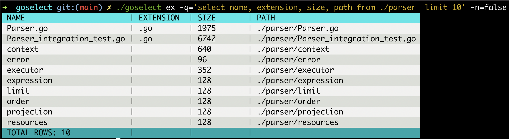
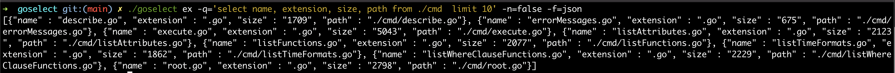

# goselect [](https://codecov.io/gh/SarthakMakhija/goselect)

| Platform      | Build Status                                                                                                                |
|---------------|:----------------------------------------------------------------------------------------------------------------------------|
| Ubuntu latest |  |
| macOS 11      |            |
| macOS 12      |            |

*goselect* provides SQL like 'select' interface for files. This means one can execute a select query like:
```SQL
select name, path, size from . where or(like(name, result.*), eq(isdir, true)) order by 3 desc
```
to get the file name, file path and size of all the files that are either directories or their names begin with *result*. The result will be ordered by *size* in descending order.

# Why goselect

The project *goselect* was created to understand the following:

&#x1F539; **Parsing**. The parsing pipeline typically involves a lexer, a parser and an AST.

&#x1F539; **Recursive descent parser**

&#x1F539; **Representation of functions in the code**. Functions like `lower`, `upper` and `trim` take a single parameter, functions like `now` and `currentDate` take zero parameters whereas functions like `concat` take a variable number of parameters.

&#x1F539; **Execution of scalar functions like `lower`, `upper` and `substr`**. These functions are stateless and run for each row. They may take a parameter and **return a value for each row**. These functions can also involve nesting. For example, `lower(substr(ext, 1))`.

&#x1F539; **Execution of aggregation functions like `average`, `min`, `max` and `countDistinct`**. These functions run over a collection of rows and **return a final value**. These functions can also involve nesting. For example, `average(count())`.

&#x1F539; **Execution of nested scalar and aggregation functions like `countDistinct(lower(name))`**. Here, the function `lower(name)` runs for each row whereas `countDistinct` runs over a collection of rows.

# [Content organization](#table-of-contents)
  * [Example queries](#example-queries)
  * [Feature overview](#feature-overview)
  * [Differences between SQL select and goselect](#differences-between-sql-select-and-goselect)
  * [Supported platforms](#supported-platforms)
  * [Installation](#installation)
    * [MacOS](#macos)
    * [Linux AMD64](#linux-amd64)
  * [Changelog](#changelog)
    * [Version 0.0.6](#version-006)
    * [Version 0.0.5](#version-005)
    * [Version 0.0.4](#version-004)
    * [Version 0.0.3](#version-003)
    * [Version 0.0.2](#version-002)
  * [Commands](#commands)
  * [Queries in detail](#queries-in-detail)
  * [FAQs](#faqs)
  * [All the supported features](#all-the-supported-features)
  * [Unsupported ideas](#unsupported-ideas)
  * [Screenshots](#screenshots)
  * [Planned changes](#planned-changes)

# Example queries

```SQL
- select * from .
- select * from . limit 10
- select name, size from . where gt(size, 1024)
- select name, size from . where gt(size, 1024) order by 2 desc
- select name, size from . where gt(size, 1024) order by 2 
- select name, size from . where gt(size, 1024) order by 2 limit 10
- select name, size from . where or(like(name, result.*), eq(isdir, true)) order by 2 limit 10
- select name, size from ~/Documents where or(like(name, result.*), eq(isdir, true)) order by 2 limit 10
```

# Feature overview 

*goselect* provides various features including:
1. Support for attribute aliases. For example, **filename** is same as **fname**
2. Support for function aliases. For example, **lower** is same as **low**
3. Support for various string scalar functions like `lower`, `upper`, `concat`, `substr` etc
4. Support for various comparison scalar functions `eq`, `le`, `lt`, `ge`, `gt` etc
5. Support for various date based scalar functions `now`, `extract`, `parsedatetime`, `daysdifference` etc
6. Support for various composite scalar functions `or`, `and`, `not` etc
7. Support for various mime type scalar functions `isText`, `isPdf`, `isImage` etc
8. Support for various aggregate functions like `count`, `countdistinct`, `average` etc
9. Support for exporting the results in **table**, **json** and **html** format
10. Support for performing select in nested directories
11. Support for skipping directories like `.git` & `.github`

# Differences between SQL select and goselect

Features that are different from SQL:
1. *goselect* does not support 'group by'. All the aggregating functions return results that repeat for each row
2. *goselect* does not support expressions like `1+2` or `1*2`. Instead, *goselect* gives functions like 'add' and 'mul' etc to write such expressions
3. *goselect* does not support expressions like `name=sample.log` in 'where' clause. Instead, various functions are given to represent such expressions. These functions include: `eq`, `ne`, `lt`, `ge` etc
4. *goselect* has a weak grammar. For example, a query like: 
```SQL 
select 1+2, name from /home/projects
``` 
will ignore `1+2` and return file names

5. *goselect's* 'order by' clause supports only attribute positions. For example, a query like: 
```SQL
select name, size from /home/projects order by 1
```
will order the results by the first attribute `name`

# Supported platforms

- *goselect* has been tested on **macOS Big Sur 11.4**, **macOS Monterey 12.6** and **Ubuntu 20.0.3**

# Installation

### MacOS

1. **Download the current release**
   - `wget -o - https://github.com/SarthakMakhija/goselect/releases/download/v0.0.6/goselect_0.0.6_Darwin_all.tar.gz`

2. **Unzip the release in a directory**
   - `mkdir goselect && tar xvf goselect_0.0.6_Darwin_all.tar.gz -C goselect`

### Linux AMD64

1. **Download the current release**
   - `wget -o - https://github.com/SarthakMakhija/goselect/releases/download/v0.0.6/goselect_0.0.6_Linux_x86_64.tar.gz`

2. **Unzip the release in a directory**
   - `mkdir goselect && tar xvf goselect_0.0.6_Linux_x86_64.tar.gz -C goselect`

# Changelog

### Version 0.0.6

1. Support for single and double quotes. For example, `goselect ex -q='select name, extension from . where eq(name, "hello world.txt")'`
2. Support for groups in regular expressions. For example, `goselect ex -q='select name, extension from . where like(name, "^([0-9]{4})-[0-9]{2}-[0-9]{2}-.*\.txt$")'`
3. Addition of a new function `isArchive`

### Version 0.0.5

1. Addition of a new function `parseSize` makes the comparison based on file size easier. Use, `select * from . where gt(size, parseSize(15 Mb))`
2. Addition of 't' as a shorthand for the flag 'term' in describe command
3. Addition of new flags 'minWidth' and 'maxWidth' for controlling the width of the attributes while exporting as table. Usage: `goselect ex -q='select name, ext, size, fmtsize(size), isdir from .' --minWidth=10 --maxWidth=50`, will put a minimum of 10 characters and maximum of 50 characters in each row. 
4. Table export does not capitalize the headers
5. Removal of 'sorted' flag from `listAttributes`, `listFunctions`, `listWhereClauseFunctions` and `listTimeFormats` commands

### Version 0.0.4

1. Inference of input values as numeric, floating point, string and boolean
2. Addition of functions: isImage, isText, isPdf, isAudio, isVideo to where clause
3. Improvement in the performance of the function like
4. Introduction of new functions: startsWith, endsWith and ifBlank
5. Introduction of version command

#### Version 0.0.3

1. Adoption of consistent file size units. File size is now reported in IEC units: (B, KiB, MiB, GiB, TiB, PiB, EiB) 
2. No extension is reported for hidden files
3. `*` projection now returns `name`, `extension`, `size` and `absolute path`
4. `fmtsize` is provided as a function that can be used to format the file size
5. `hsize` (or human-readable size) is dropped from attribute list in favor of the function `fmtsize`. Use `fmtsize(size)` to get the formatted size 

#### Version 0.0.2

1. Support for getting the **mime type** from a file
2. Support for various functions like `isPdf`, `isVideo`, `isText`, `isAudio` and `isImage` that work on the **mime type**

*Example Queries for mime type*

```SQL
1. select name, size, mime from ~/Documents/ where eq(isImage(mime), true)  order by 2 desc limit 10
2. select name, size, mime from ~/Documents/ where eq(isPdf(mime), true)  order by 2 desc limit 10
```

# Commands

| **Command**              	| **Description**                                                	| **Available  since** 	| **Example usage**                     	|
|--------------------------	|----------------------------------------------------------------	|----------------------	|---------------------------------------	|
| listAttributes           	| List all the attributes supported by goselect                  	| v0.0.1               	| goselect listAttributes               	|
| listFunctions            	| List all the functions supported by goselect                   	| v0.0.1               	| goselect listFunctions                	|
| listWhereClauseFunctions 	| List all the functions supported by goselect in 'where' clause 	| v0.0.1               	| goselect listWhereClauseFunctions     	|
| listTimeFormats          	| List the date/time formats supported by goselect               	| v0.0.1               	| goselect listTimeFormats              	|
| describe                 	| Describe an attribute or a function                            	| v0.0.1               	| goselect describe --term=lower        	|
| execute                  	| Execute a select query                                         	| v0.0.1               	| goselect execute -q='select * from .' 	|
| version                  	| Return the current version of goselect                         	| v0.0.4               	| goselect version                      	|

# Queries in detail

### Projections

1. **Use * as projection**
```SQL
goselect ex -q='select * from . '
```

2. **Select name, size, extension, absolute path using aliases**
```SQL
goselect ex -q='select name, size, ext, abspath from . '
```

3. **Select just the file name without its extension**
```SQL
goselect ex -q='select basename, extension from . '
```

4. **Determine if a file is a directory or not**
```SQL
goselect ex -q='select name, isdir, isfile from .'
```

5. **Select created time, access time and modified time of all the files**
```SQL
goselect ex -q='select name, ctime, atime, mtime from .'
```

6. **Select the mime type of all the files**
```SQL
goselect ex -q='select name, mime from .'
```

7. **Select file name in upper case and format the file size**
```SQL
goselect ex -q='select upper(name), size, formatsize(size) from .'
```

8. **Select the length of all the file names**
```SQL
goselect ex -q='select name, len(name) from .'
```

9. **Select the length of all the file extensions without including . in the length**
```SQL
goselect ex -q='select name, ext, len(substr(ext, 1)) from .'
```

10. **Select name and extension of all the files, but return NA if there is no extension**
```SQL
goselect ex -q='select name, ifblank(ext, NA) from .'
```

11. **Select trimmed file names**
```SQL
goselect ex -q='select trim(name), ltrim(name), rtrim(name) from .'
```

12. **Concat the basename, extension and the formatted file size**
```SQL
goselect ex -q='select concat(basename, ext, fmtsize(size)) from .'
```

13. **Concat the basename, extension and the formatted file size with a separator @**
```SQL
goselect ex -q='select concatWs(basename, ext, fmtsize(size), @) from .'
```

14. **Determine if a file name contains the string project**
```SQL
goselect ex -q='select name, contains(name, project) from .'
```

15. **Replace all the dots (.) in file names with a hash (#)**
```SQL
goselect ex -q='select name, replaceall(name, ., #) from .'
```

16. **Determine if a file name starts with a string go**
```SQL
goselect ex -q='select name, startswith(name, go) from .'
```

17. **Determine if a file name ends with a string go**
```SQL
goselect ex -q='select name, endswith(name, go) from .'
```

18. **Select the date from the access time of the files**
```SQL
goselect ex -q='select name, atime, extract(atime, date) from .'
```

19. **Select current month, current year, current date, day of the week and current day**
```SQL
goselect ex -q='select cmonth(), cyear(), cdate(), dayofweek(), cday() from . limit 1'
```

20. **Select file name and determine if the user can read, write and execute a file**
```SQL
goselect ex -q='select name, uread, uwrite, uexecute from .'
```

### Order by and limit

1. **Order the results by size in descending order**
```SQL
goselect ex -q='select name, size, ext, abspath from . order by 2 desc'
```

2. **Order the results by size in descending order and limit the total number of results to 5**
```SQL
goselect ex -q='select name, size, ext, abspath from . order by 2 desc limit 5'
```

### Aggregate functions

1. **Count all the entries in the current directory**
```SQL
goselect ex -q='select count() from .'
```

2. **Count distinct file extensions**
```SQL
goselect ex -q='select countDistinct(ext) from .'
```

3. **Select the sum of size of all the files and also return the average file size**
```SQL
goselect ex -q='select sum(size), avg(size) from .'
```

4. **Select the sum of size of all the files and also return the average file size, but format the sizes**
```SQL
goselect ex -q='select fmtsize(sum(size)), fmtsize(avg(size)) from .'
```

5. **Select the minimum and the maximum file size**
```SQL
goselect ex -q='select min(size), max(size) from .'
```

6. **Select the minimum and the maximum length of all the file names**
```SQL
goselect ex -q='select min(len(name)), max(len(name)) from .'
```

### Where clause

1. **Select file name and extension of all the files containing the string go in their name**
```SQL
goselect ex -q='select name, extension from . where contains(name, go)'
```

2. **Select file name and extension of all the files if their names begin with READ, followed by numbers, followed by any number of characters**
```SQL
goselect ex -q='select name, extension from . where like(name, ^READ[0-9].*)'
```

3. **Select file name and extension of all the files if their names start with READ**
```SQL
goselect ex -q='select name, extension from . where startswith(name, READ)'
```

4. **Select file name and extension of all the files if their names end with go**
```SQL
goselect ex -q='select name, extension from . where endswith(name, go)'
```

5. **Select file name and extension of all the text files**
```SQL
goselect ex -q='select name, extension from . where isText(mime)'
```

6. **Select file name and extension of all the image files**
```SQL
goselect ex -q='select name, extension from . where isImage(mime)'
```

7. **Select file name and extension of all the audio files**
```SQL
goselect ex -q='select name, extension from . where isAudio(mime)'
```

8. **Select file name and extension of all the video files**
```SQL
goselect ex -q='select name, extension from . where isVideo(mime)'
```

9. **Select file name and extension of all the pdf files**
```SQL
goselect ex -q='select name, extension from . where isPdf(mime)'
```

10. **Select file name and extension of all the archive files (Version 0.0.6)**
```SQL
goselect ex -q='select name, extension from . where isArchive(mime)'
```

11. **Select file name, extension and size of all the files if their size is greater than 1 Mib**
```SQL
goselect ex -q='select name, extension, size, fmtsize(size) from . where gt(size, mul(1, 1024, 1024))'

1 Mib = 1 * 1024 * 1024 bytes
```
**Or**
```SQL
goselect ex -q='select name, extension, size, fmtsize(size) from . where gt(size, 1048576)'
```
**Or (Version 0.0.5)**
```SQL
goselect ex -q='select name, extension, size, fmtsize(size) from . where gt(size, parseSize(1 Mib))'
```

12. **Select file name, extension and size of all the files if their size is greater than or equal to 1 Mib**
```SQL
goselect ex -q='select name, extension, size, fmtsize(size) from . where gte(size, mul(1, 1024, 1024))'
```
**Or**
```SQL
goselect ex -q='select name, extension, size, fmtsize(size) from . where gte(size, 1048576)'
```
**Or (Version 0.0.5)**
```SQL
goselect ex -q='select name, extension, size, fmtsize(size) from . where gte(size, parseSize(1 Mib))'
```

13. **Select file name, extension and size of all the files if their size is less than 1 Mib**
```SQL
goselect ex -q='select name, extension, size, fmtsize(size) from . where lt(size, mul(1, 1024, 1024))'
```
**Or**
```SQL
goselect ex -q='select name, extension, size, fmtsize(size) from . where lt(size, 1048576)'
```
**Or (Version 0.0.5)**
```SQL
goselect ex -q='select name, extension, size, fmtsize(size) from . where lt(size, parseSize(1 Mib))'
```

14. **Select file name, extension and size of all the files if their size is less than or equal to 1 Mib**
```SQL
goselect ex -q='select name, extension, size, fmtsize(size) from . where lte(size, mul(1, 1024, 1024))'
```
**Or**
```SQL
goselect ex -q='select name, extension, size, fmtsize(size) from . where lte(size, 1048576)'
```
**Or (Version 0.0.5)**
```SQL
goselect ex -q='select name, extension, size, fmtsize(size) from . where lte(size, parseSize(1 Mib))'
```

15. **Select file name, extension and size of all the files if their size equal to 600 bytes**
```SQL
goselect ex -q='select name, extension, size, fmtsize(size) from . where eq(size, 600)'
```
**Or (Version 0.0.5)**
```SQL
goselect ex -q='select name, extension, size, fmtsize(size) from . where eq(size, parseSize(600 B))'
```

16. **Select file name, extension and size of all the files if their extension is equal to .go**
```SQL
goselect ex -q='select name, extension, size, fmtsize(size) from . where eq(ext, .go)'
```

17. **Select file name, extension and size of all the files if their extension is not equal to .go**
```SQL
goselect ex -q='select name, extension, size, fmtsize(size) from . where ne(ext, .go)'
```

18. **Select file name and extension of all the text files if their names start with lowercase test**
```SQL
goselect ex -q='select name, extension from . where and(isText(mime), startsWith(lower(name), test))'
```

19. **Select file name of all the hidden files and directories**
```SQL
goselect ex -q='select name from . where or(eq(isDir, true), eq(isHidden, true))'
```
**Or**
```SQL
goselect ex -q='select name from . where or(isDir, isHidden)'
```

20. **Select count of all the hidden files**
```SQL
goselect ex -q='select count(), name from . where eq(isHidden, true)'
```

21. **Select count of all the pdf files**
```SQL
goselect ex -q='select count() from . where eq(isPdf(mime), true)'
```

21. **Select sum of size of all the hidden files**
```SQL
goselect ex -q='select fmtsize(sum(size)), size from . where eq(isHidden, true)'
```

22. **Select all the files that are not hidden**
```SQL
goselect ex -q='select name, extension from . where not(isHidden, true)'
```
**Or**
```SQL
goselect ex -q='select name, extension from . where eq(isHidden, false)'
```

23. **Select basename and extension of all the files with .log as the extension and their basename should have a date format: Year-Month-Date (for example, 2022-09-28)**
```SQL
goselect ex -q='select basename, ext from . where and(eq(ext, .log), like(basename, [0-9]{4}-[0-9]{2}-[0-9]{2}))'
```

24. **Select file name and extension of all the files that were accessed 2 or more days earlier**
```SQL
goselect ex -q='select name, ext, atime from . where gte(daysdiff(atime), 2)'

Default value of second parameter in daysdiff is now()
```

25. **Select file name and extension of all the files that were modified on or after 2022-09-22**
```SQL
goselect ex -q='select name, ext, mtime from . where gt(mtime, parseDateTime(2022-09-22, dt))'

Here, parseDateTime is given a date without timezone, that means while comparing mtime and the input value, timezone may play role. 
'2022-09-22' will have UTC as the timezone that might not be same the timezone of mtime.   
```

### Using quotes in queries (Version 0.0.6)

1. **Select size and the formatted size of the file that has hello world.txt as the name** 
```SQL
goselect ex -q='select size, formatSize(size) from . where eq(name, "hello world.txt")'
```

2. **Select size and the formatted size of the file that has hello world.txt as the name (query begins with double quotes)**
```SQL
goselect ex -q="select size, formatSize(size) from . where eq(name, 'hello world.txt')"
```

3. **Select size and the formatted size of the file that has "hello world.txt" as the name (file name contains double quotes)**
```SQL
goselect ex -q='select size, formatSize(size) from . where eq(name, \"hello world.txt\")'
```

4. **Select size and the formatted size of the file that has "hello world.txt" as the name (query begins with double quotes and the file name contains double quotes)**
```SQL
goselect ex -q="select size, formatSize(size) from . where eq(name, \\\"hello world.txt\\\")"
```

# FAQs

1. **How do I get a list of all the supported attributes?**

Use `goselect listAttributes` or `goselect attrs` to get all the supported attributes.

**Usage**
```shell
goselect listAttributes 
goselect attrs 
```

2. **How do I get a list of all the supported functions?**

Use `goselect listFunctions` or `goselect fns` to get all the supported functions.

**Usage**
```shell
goselect listFunctions 
goselect fns 
```

3. **How do I get the description or the purpose of a function or an attribute?**

Let's say that we want to get the description of `fname`. In order to do that, use `goselect describe --term=fname`. `term` flag
can be given an attribute name or a function name.

**Usage**
```shell
goselect describe --term=fname 
goselect desc --term=path 
goselect desc --term=lower 
```

4. **Are there any functions to parse an input in date/time type?**

Yes, *goselect* supports a function `parsedatetime` to parse an input string in `time` type. It takes 2 parameters, the first parameter is a string to be parsed and the second is the format identifier.

5. **How do I get the supported date/time formats and their identifiers?**

Use `goselect listTimeFormats` or `goselect fmts` to get all the supported date/time formats along with their identifiers.

**Usage**
```shell
goselect listTimeFormats 
goselect fmts 
```

6. **Are the select queries case-sensitive?**

No, the select queries are case-insensitive.

7. **Are all the functions supported in where clause?**

No, *goselect* supports a set of functions that can be used in `where` clause. Use `goselect listWhereClauseFunctions` to get a list of all the functions that can be used in `where` clause.

**Usage**
```shell
goselect listWhereClauseFunctions 
goselect wherefns 
```

8. **Can I get some example queries that involve or/and functions?**

**Usage**
```shell
1. goselect execute -q='select * from . where or(like(name, result.*), eq(ishidden, true))' 
2. goselect execute -q='select * from . where and(like(name, result.*), eq(isdir, false))' 
```
- The first query returns all the files where name is like `result.*` and the file is a hidden file. 
- The second query returns all the files where name is like `result.*` and the file is not a directory. 

8. **Can I get some example queries that involve date/time functions?**

**Usage**
```shell
1. goselect execute -q='select atime, extract(atime, date) from .' 
2. goselect execute -q='select atime, extract(atime, date) from . where gt(daysdifference(atime), 2)'  
```
- The first query extracts the `date` from the `access time` of a file
- The second query returns all the files where difference (in days) between today and the access time of a file is greater than 2

9. **Can I get some example queries that aggregate functions?**

**Usage**
```shell
1. goselect execute -q='select count(), min(len(name)) from .' 
2. goselect execute -q='select countdistinct(ext) from .'  
```
- The first query returns the count of all the entries in the source directory along with the minimum file length 
- The second query returns all the distinct file extensions in the source directory

# All the supported features

- Support for `where` clause
  ```SQL
  - [X] select * from /home/apps where eq(add(2,3), 5)
  - [X] select * from /home/apps where eq(lower(ext), .log)
  - [X] select * from /home/apps where ne(lower(ext), .log)
  - [X] `where` clause supports functions for comparison like `eq`, `le`, `lt`, `ge`, `gt`, `ne`, `contains`, `or`, `and`, `not` etc
  ```
- Support for projections
  - [X] projections with attribute name: `name`, `size`
  - [X] projections with alias in attribute name: `fName` instead of `name`
  - [X] projections with scalar functions: `contains`, `lower`
  - [X] projections with alias in scalar functions: `low` instead of `lower`
  - [X] projections with aggregate functions: `min`, `max`
  - [X] projections with equivalent of expressions like add(1, 2)
- Support for `order by` clause
  - [X] order by with positions: `order by 1`
  - [X] order by in descending order: `order by 1 desc`
  - [X] order by in optional ascending order: `order by 1 asc`
- Support for `limit` clause
  - [X] limit clause with a value: `limit 10`
- Support for various functions
  
- Support for formatting the results
  - [X] Json formatter
  - [X] Html formatter
  - [X] Table formatter
- Support for exporting the formatted result
  - [X] Console
  - [X] File

# Unsupported ideas

*goselect* does not support the following:

1. **Use of parentheses inside a function call.**
One can not use parentheses inside a function call. This means the following queries are treated invalid:  
```SQL
select * from . where eq(add(2, 3), (4))

select * from . where lt(size, (add(2, 3)))
```

If a file name contains parentheses, then one could use single or double quotes in the query to match such a file name. 
```SQL
select * from . where eq(name, "hello (1).txt")
```

2. **Use of expressions in order by.**
*goselect* supports attribute positions in order by. This means the following queries are treated invalid:
```SQL
select name, extension from . order by name

select name, extension from . order by lower(name)
```

# Screenshots

- Limit clause
  

- Where clause
  

- Export as json
  

- Export as json to a file
  

# Planned changes

1. Support for checking if a (text) file contains a specific term
2. Caching the expression results. This is useful for cases like `select lower(name) from . where eq(lower(name), sample)`. In this example, `lower(name)` need not be evaluated twice for a row 
3. Support for concurrent execution and streaming the results as soon as available. Will not work for `order by` and `aggregate` functions. It is applicable for queries that involve scalar functions without order by. It might make sense to use this feature where the number of files is too many, say more than 0.1 million
4. Support installation using `brew`, `apt`, `yum`
5. Support for `between` scalar function
6. Windows support
